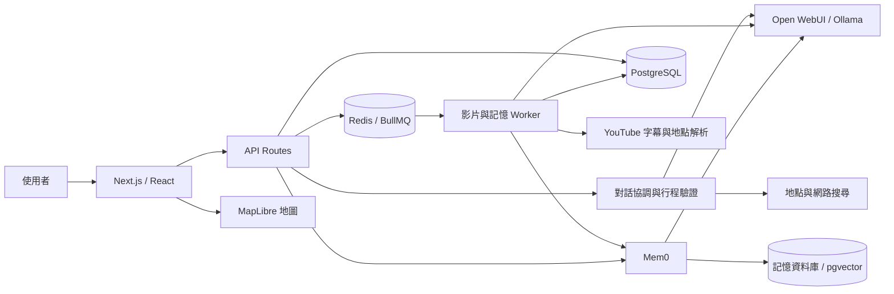

# AIYO — 結合影片內容與個人偏好的對話式旅遊規劃系統

AIYO 將旅遊影片中的地點資訊、使用者偏好與地圖資料整合到同一個行程編輯流程。使用者可以用自然語言提出旅行需求，從 YouTube 影片擷取候選景點，檢視有來源依據的摘要與時間片段，再把地點加入可編輯、可儲存的每日行程。

本專案著重生成式 AI 的應用整合：模型負責理解需求、整理內容與提出行程；程式負責驗證結構、查核地點、限制操作範圍，以及維持行程、地圖與資料庫的一致性。開發重點包括多輪對話、影片證據對齊、非同步工作、個人化資料使用及錯誤恢復。

目前定位為可在本機部署與驗證的系統原型。已有實際模型、影片、記憶與資料庫的流程驗證，但尚未完成多人負載測試、影片標註集的品質評估或正式環境服務水準驗收。

> 文件核對日期：2026-10-04。功能基準為 `7cb2d2b`；最近一份完整實作驗證紀錄為 2026-09-21。本次文件整理不代表重新完成線上或效能測試。

## 閱讀導覽

| 閱讀目的 | 文件 |
| --- | --- |
| 理解模組責任、資料流與系統邊界 | [系統架構](docs/architecture.md) |
| 從原始碼啟動網站與背景工作 | [部署與操作](docs/setup.md) |
| 理解資料表、API 與權限邊界 | [資料模型與介面](docs/data-and-api.md) |
| 查看問題、修正與技術取捨 | [工程決策與演進](docs/engineering-decisions.md) |
| 判讀測試成果與尚未驗證的部分 | [測試與評估](docs/evaluation.md) |
| 修改程式或提交變更 | [應用程式開發](aiyo/README.md)、[貢獻指南](CONTRIBUTING.md) |
| 追查各階段原始報告 | [專案文件索引](docs/README.md)、[應用文件索引](aiyo/docs/README.md) |

## 問題背景與設計目標

旅遊規劃通常需要在影片、搜尋結果、地圖與筆記之間反覆切換。影片中的景點可能只有口語名稱，沒有地址；同名店家或分店可能位於不同城市；一份讀起來合理的行程，也可能缺少移動時間、餐食或返程緩衝。加入語言模型後，還需要處理格式不穩定、無來源內容與修改意圖誤判等問題。

AIYO 以三個目標組織實作：

1. **保留資料依據。** 影片時間應來自字幕或其他可定位來源；景點應有可搜尋名稱與地理證據。資料不足時顯示限制，不補造座標或影片時間。
2. **讓對話能落實為可控操作。** 區分問答、建立行程與局部修改；結構化動作經過驗證才套用，整天清空等操作需要確認。
3. **維持操作後的資料一致。** 行程編輯、地圖標記、背景補資料與持久化必須相互對應，重新整理後仍能還原使用者確認的內容。

## 主要功能與實作範圍

| 功能 | 目前實作 | 邊界 |
| --- | --- | --- |
| 對話式規劃 | 跨輪補充目的地、天數與偏好；建立及增刪改排行程；串流文字與處理進度 | 意圖判斷含規則與模型流程，尚未量測廣泛語句的成功率 |
| 影片分析 | YouTube 字幕取得、分段地點抽取、有來源的摘要、時間片段與地點匯入 | 無字幕或來源受限時可能只有描述摘要；未完成完整視覺理解與 ASR 備援 |
| 地圖與行程 | MapLibre 地圖、天數篩選、選點定位、地點搜尋、可用路段的時間與距離 | 示意線不等於導航；沒有全球即時公共運輸班次能力 |
| 偏好與記憶 | 已確認偏好沿用、Mem0 記憶讀寫、候選地點的興趣排序與排除 | 排序依名稱及場所類別；不能由缺少的資料推斷過敏原、價格或無障礙條件 |
| 編輯與保存 | 手動排序、交易式儲存、活動與標記連結、儲存競態防護 | 尚未提供多端同時編輯的 CRDT／OT 合併機制 |
| 分享與協作 | 行程資料夾、協作者、留言與在線狀態、公開快照與複製 | 公開內容由快照欄位篩選產生，不直接開放私人行程資料 |
| 背景處理 | BullMQ／Redis 影片與記憶佇列、重試、影片進度恢復與結果擁有者檢查 | 需要獨立 worker；聊天 SSE 進度仍在單一 Node 程序內 |

## 系統概觀



前端顯示進度與可編輯資料，後端控制模型、搜尋、驗證及儲存。影片和記憶寫入由背景程序處理，避免每次操作都等待完整模型工作。地圖顯示、地點查詢與路線計算分別由不同元件及供應者負責，不能把其中一項成功視為整條流程正確。

## 技術組成

以下版本依儲存庫宣告；npm 的精確解析版本以 [package-lock.json](aiyo/package-lock.json) 為準。

| 層次 | 技術 | 用途 |
| --- | --- | --- |
| Web 應用 | Next.js 16、React 19、TypeScript | App Router 頁面、API Routes 與前後端型別 |
| 介面與狀態 | Tailwind CSS 4、Zustand、dnd-kit | 樣式、行程／聊天狀態與拖曳排序 |
| 主資料 | PostgreSQL 16、Prisma 6 | 使用者、行程、影片互動、公開快照及交易式寫入 |
| 背景工作 | Redis 7、BullMQ 5、ioredis | 影片分析、記憶寫入、重試與工作狀態 |
| 模型服務 | Ollama、Open WebUI | 本機模型推論、gateway、任務模型設定與串流 |
| 長期記憶 | Mem0、pgvector、Hugging Face embedder | 偏好記憶擷取與檢索；獨立資料庫 |
| 地理資訊 | MapLibre GL、Photon、Overpass、OSRM | 地圖呈現、地點搜尋、附近資料與道路路線 |
| 影片來源 | YouTube Data API、youtube-transcript、yt-dlp | 影片搜尋、中繼資料及字幕取得路徑 |
| 搜尋補充 | Serper／Tavily | 需要外部資料時的旅遊搜尋 |
| 身分驗證 | NextAuth 4、bcryptjs | Google OAuth、Email／Password、JWT session |
| 驗證 | Node test runner／tsx、Playwright、ESLint | 單元、整合、瀏覽器流程與靜態檢查 |

## 本機執行

主要開發環境為 Windows／PowerShell、Docker Desktop 與宿主機 Ollama。完整設定請依 [部署文件](docs/setup.md) 操作；單純執行 `npm run dev` 不會啟動資料庫、模型或 worker。

```powershell
git clone https://github.com/AlbertLin821/AIYO_new.git
cd AIYO_new
Copy-Item aiyo/.env.dev.example aiyo/.env.dev
# 先依部署文件填入自有設定與密鑰，再啟動相依服務。
```

相依服務就緒後，在 `aiyo/` 安裝依賴、產生 Prisma client、套用 migration，並分別執行網站與 worker。部署文件提供宿主機與容器兩種方式，也說明 Open WebUI 的宿主機 `18080` 與容器內 `8080` 的差異。

## 驗證結果與限制

2026-10-04 文件核對時重新執行：668 項單元測試、正式建置及型別檢查通過；全專案 lint 為 0 errors、6 項既有 warnings。本次未重跑線上模型與瀏覽器流程，詳見[本次檢查紀錄](docs/documentation-review-2026-10-04.md)。

2026-09-21 的[實作驗證報告](aiyo/docs/optimization-verification-2026-09-21.md)記錄：

- 668 項單元測試通過，正式建置及 TypeScript 檢查通過。
- 真實影片分析完成，產生 8 個片段與 13 個地點；這是單一案例，不是整體正確率。
- 真實記憶新增、查看、修改、刪除，以及行程保存後重新載入取得通過證據。
- 真實 AI 生成、問答、替換、新增與刪除分批取得通過證據；不是同一次五項全過。
- 初次完整網站回歸為 45 通過、4 失敗、3 未執行，之後修正並定向複測；不能寫成單次 52/52 通過。

效能仍是待改善項目：當次一般聊天約 39.6 秒，東京三天行程初次生成整段案例約 4.3 分鐘。背景佇列和串流改善等待與恢復，但不會消除模型推論、外部搜尋及冷啟動時間。上述數字不是正式環境 P95，也不是今天的重測結果。

後續評估重點為影片地點與時間的標註集、偏好衝突及跨輪對話成功率、冷熱啟動延遲，以及多人使用時的服務可靠性。詳細定義見[測試與評估](docs/evaluation.md)。

## 儲存庫結構

```text
aiyo/                    主應用程式、測試、Prisma schema 與 migration
  src/app/               頁面與 HTTP API
  src/components/        對話、行程、地圖與影片介面
  src/server/            規劃、搜尋、地理資訊、記憶與工作佇列
  src/services/          前端 API client、同步與匯入
  src/stores/            Zustand 狀態
  tests/                 整合與瀏覽器測試
  scripts/               本機啟動、worker、驗證與資料準備
docs/                    架構、部署、評估與工程決策
docker/                  Mem0 映像及相容性修正
scripts/                 跨服務部署、備份與維護工具
archive/legacy/          歷史資產；其中 Mem0 原始碼仍供映像建置使用
.github/workflows/       GitHub Actions
docker-compose.yml       本機多服務拓樸
```

## 開發、資料與授權

修改前請閱讀 [AGENTS.md](AGENTS.md)、[應用規則](aiyo/AGENTS.md)及[貢獻指南](CONTRIBUTING.md)。測試資料、故障注入與正式規劃邏輯應明確區分；不能以刪除斷言或補入假地點掩蓋正式流程的問題。

使用者對話、偏好、影片互動與行程可能包含個人資料。金鑰、資料庫備份和含個資的測試產物不應提交到儲存庫。安全回報及部署邊界見 [SECURITY.md](SECURITY.md)。

本儲存庫尚未指定自有程式碼的統一開源授權。第三方原始碼、模型與服務各有其授權或使用條件，不能因儲存庫公開就視為可任意再散布。依賴與第三方來源見 [THIRD_PARTY_NOTICES.md](THIRD_PARTY_NOTICES.md)。
