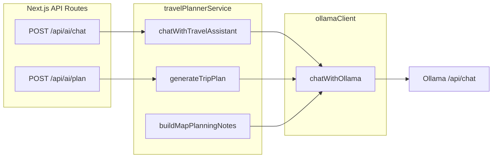

# Ollama 模型與 Prompt 說明

本文整理 **AIYO**（`aiyo/`）內會進入 **Ollama `/api/chat`** 的訊息，以及與其直接相關的 prompt 組裝程式。**以下以「檔案」為單位**逐段說明每則文字／函式的用途。

---

## 快速索引：出現「會送進 Ollama 的 prompt」的檔案

| 檔案 | 與 Ollama 的關係 |
|------|------------------|
| [`src/server/ai/ollamaClient.ts`](../src/server/ai/ollamaClient.ts) | **唯一 HTTP 出口**；每次請求自動插入**全域 system** |
| [`src/server/services/travelPlannerService.ts`](../src/server/services/travelPlannerService.ts) | 唯一呼叫 `chatWithOllama` 的業務層；內嵌多則 **system／動態 assistant／user** |
| [`src/server/ai/promptBuilder.ts`](../src/server/ai/promptBuilder.ts) | 多數**長篇規則與 schema** 字串；由 `travelPlannerService` 組進訊息（另有僅測試使用的預留函式） |

以下章節依上表順序**詳解**。API Route（`chat/route.ts`、`plan/route.ts`）本身**不內含 prompt 字串**，只轉呼叫上述服務。

---

## 1. `src/server/ai/ollamaClient.ts`

### 1.1 職責

- 對 `OLLAMA_BASE_URL` 發 `POST .../api/chat`。
- 依 `task` 呼叫 `resolveModelForTask` 選模型（見後文「環境變數」表）。
- 將呼叫端傳入的 `messages` 與**固定一則全域 system** 合併後送出；可選 `format: "json"` 交給 Ollama 做 JSON 模式。

### 1.2 全域 system（固定插入於 `messages` 最前）

**原文要旨（程式內為單一字串）：**

- 只能輸出**繁體中文**，禁止簡體。
- 若輸出 JSON：**key** 必須依 schema **不變**；**可讀的字串值**仍須繁中。
- **可保留原文**：URL、程式碼、模型名稱、專有名詞、原文地名。

**用途：**在所有業務 system（例如「You are AIYO…」）**之前**再套一層語系與 JSON 值的統一約束，避免模型混用簡體或亂改 JSON 欄位名。

**訊息順序：**`[ 全域 system ] + [ 呼叫端傳入的 messages… ]`

---

## 2. `src/server/services/travelPlannerService.ts`

本檔是 **唯一** 呼叫 `chatWithOllama` 的程式。除匯入 `promptBuilder` 的長文外，還有**內嵌英文短 system**、**動態 assistant**、以及**注入第二輪 user 的研究摘要**（含一段固定繁中 fallback）。

### 2.1 `normalizeHistory`（非 export，僅內部）

**觸發條件：**`context.itinerary` 有資料。

**產生一則 `role: "assistant"` 訊息**，內容為「目前行程列表」文字，語言依 `language`：

| `language` | 開頭字樣 | 用途 |
|------------|----------|------|
| `traditional-chinese` | `目前行程脈絡：\n` + 各 Day 的 `time` + `title` 串 | 讓模型知道使用者畫面上已有哪些行程，利於接續規劃與不重複 |
| `japanese` | `現在の旅程コンテキスト:\n` + 同上結構 | 同上，日文介面語境 |
| `english` | `Current itinerary context:\n` + 同上結構 | 同上，英文語境 |

**用途：**在**不**改寫使用者本輪 `user` 字串的前提下，把「結構化行程」塞進對話上下文（Ollama 多輪中的 assistant 區塊）。

### 2.2 `normalizeConversationHistory`（非 export）

**觸發條件：**傳入 `messages` 陣列有內容。

**行為：**取最後 **8** 則，`role` 為 `user` / `assistant` / `ai` 的訊息；映射成 Ollama 的 `user` 或 `assistant`（`ai` 當作 `assistant`）。

**用途：**讓旅遊助理記住最近幾輪對話，與本輪 research／reply 一併送進模型。

### 2.3 `generateTripPlan` — 行程 JSON（`task: "trip-plan"`, `format: "json"`）

**訊息結構：**

| 順序 | `role` | 內容來源 | 這段 prompt 的用處 |
|------|--------|----------|---------------------|
| （由 ollamaClient 插入） | system | `ollamaClient` 全域 | 繁中 + JSON key 規則 |
| 1 | system | **內嵌字串**：`You generate structured travel itineraries. Output valid JSON only with realistic daily flows.` | 短句再次強調：只做**結構化行程**、**僅 JSON**、日與日之間要合理 |
| 2 | user | `buildItineraryPrompt(...)` 回傳的長字串 | 完整 schema、品質規則、目的地／天數／預算／興趣／必去／避免／備註、記憶區、可選 **VERIFIED RESEARCH** 與 **WEB SEARCH**、可選 **STRICT FORMAT RETRY**（見 §3.3） |

**重試時：**`user` 改為同一 `buildItineraryPrompt`，但 `retryMode: "strict-format"`；`system` 短句不變。

**解析：**`parseTripPlanResponse`；失敗則 fallback 模板。

### 2.4 `buildMapPlanningNotes` — 地圖視角說明（`task: "travel-chat"`，**無** `format`）

| 順序 | `role` | 內容來源 | 用處 |
|------|--------|----------|------|
| 全域 system | （ollamaClient） | 繁中規則 | 同上 |
| 1 | system | **內嵌**：`You summarize why a travel plan should be represented in a map view. Keep it concise.` | 請模型用**簡短**文字說明「為何此行程適合用地圖呈現」 |
| 2 | user | `buildMapPlanningPrompt(request)` | 帶入目的地、天數、興趣（見 §3.4） |

**現況：**此函式已 export，**專案內尚無其他檔 import 呼叫**；prompt 已就緒，供未來地圖 UI 串接。

### 2.5 `chatWithTravelAssistant` — 旅遊助理兩輪（`task: "travel-chat"`, `format: "json"`）

**語言：**`detectResponseLanguage(input.message)` 決定 `normalizeHistory` 的語系（見 `promptBuilder` §3.0）。

**逾時：**每輪約 `min(32000, max(12000, floor(ollamaTimeoutMs * 0.55)))`。

#### 第一輪：研究規劃（tool 請求 JSON）

| 順序 | `role` | 內容來源 | 用處 |
|------|--------|----------|------|
| 全域 system | ollamaClient | 繁中 + JSON | 同上 |
| 1 | system | `buildChatResearchPlanningPrompt` → **`.system`** | 定義角色為 travel research planner；**只輸出 JSON**；`toolRequests` 形狀；允許 `search_place` / `tavily_search` / `weather_forecast`；中文查詢用繁體；**此階段不捏造 POI 名稱** |
| 2 | assistant（可選） | `normalizeHistory` | 見 §2.1 |
| 3… | user／assistant | `normalizeConversationHistory` | 見 §2.2 |
| 最後 | user | `buildChatResearchPlanningPrompt` → **`.user`** | `User message` + `Trip context`（`formatContext`）+ `Relevant long-term memory`（`formatMemoryContext`） |

**失敗時：**不拋錯，`rawResearch` 設為 `'{"phase":"research","toolRequests":[]}'`，後續用 `buildDefaultTravelToolRequests` 補工具請求。

#### 工具與網搜（非 Ollama，但影響第二輪 prompt）

- `executeTravelToolRequests` → 產出 **digest 文字** `digestText`。
- 若 digest 為空，改用固定繁中一句注入第二輪的「研究摘要」位置：  
  `未取得可驗證的外部資料；請勿捏造具體餐廳或景點名稱，proposedChanges 請為空陣列。`  
  **用途：**強制約束第二輪模型在沒有外部證據時**不要亂加行程項目**。

- `runWebSearch` → `webSearch.digest` 可進入 `buildChatPrompt`（見 §3.2）。

#### 第二輪：使用者可見回覆（`replyText` + `proposedChanges` JSON）

| 順序 | `role` | 內容來源 | 用處 |
|------|--------|----------|------|
| 全域 system | ollamaClient | 繁中 + JSON | 同上 |
| 1 | system | `buildChatPrompt` → **`.system`** | 見 §3.2（依是否有研究／網搜切換規則） |
| 2 | assistant（可選） | `normalizeHistory` | §2.1 |
| 3… | user／assistant | `normalizeConversationHistory` | §2.2 |
| 最後 | user | `buildChatPrompt` → **`.user`** | 使用者訊息 + 行程 context + 記憶 + 可選「Verified research」區塊 + 可選「Web Search Results」區塊 |

**後處理（非 prompt）：**`sanitizeAssistantReply` 用 regex 移除助理回覆中鼓勵去 YouTube／IG 自搜的段落；`parseStructuredChatOutput` 解析 JSON；有驗證過的 place 時會 `filterProposedChangesByVerifiedPlaces`。

---

## 3. `src/server/ai/promptBuilder.ts`

本檔以**純函式**組出長字串（多為英文規則 + 動態插入的 context）。**不**直接呼叫 Ollama；由 `travelPlannerService` 決定塞進哪個 `role`。

### 3.0 `detectResponseLanguage(message)`

**用途：**依使用者本輪訊息字元判斷 `japanese` / `traditional-chinese` / `english`，供 `normalizeHistory` 選擇 itinerary 摘要語言。

**是否送 Ollama：**否，僅邏輯分支。

### 3.1 私有 `formatContext(context?)`

**用途：**把 `ChatContext` 轉成多行英文標籤文字（目的地、天數、預算、興趣、步調、交通、可選 ISO 日期、最多 12 筆行程項目摘要）。若無 context 則回固定句 *No structured trip context was provided.*

**被誰使用：**`buildChatResearchPlanningPrompt` 的 user、`buildChatPrompt` 的 user。

### 3.2 私有 `formatMemoryContext(memoryContext?)`

**用途：**有 Mem0 等注入的長期記憶字串則原样 trim 輸出；否則 *No relevant long-term memory was retrieved.*

**被誰使用：**同上兩個 build 函式的 user。

### 3.3 `buildItineraryPrompt(request, memoryContext?, options?)`

**回傳：**單一長字串，作為 **trip-plan 的 user**（見 §2.3）。

| 區塊（概念） | 內容要旨 | 用處 |
|--------------|----------|------|
| 開頭 | 只要 JSON、使用者可讀字串繁中 | 與全域 system 呼應 |
| HARD SCHEMA RULES | 單一 JSON 物件形狀：`summary`、`days[]`（`dayNumber`/`theme`/`summary`/`items[]`…）、`warnings[]` | 讓 `parseTripPlanResponse` 可解析 |
| QUALITY RULES | 每日 4–7 點、時間排序、路線合理、`mustVisit`/`avoid`、`location` 可省略不可亂填 | 提升可用行程品質 |
| DESTINATION CONSTRAINTS | 插入 request 各欄 + `formatMemoryContext` | 把使用者偏好綁進生成 |
| SELF-CHECK | 檢查 JSON、天數、必去迴避、時間與 enum | 降低格式錯誤 |
| VERIFIED RESEARCH（可選） | `externalResearch` 全文 + 一句「location.name 必須對應研究內真實場館」 | 讓 POI 名稱有外部依據 |
| WEB SEARCH（可選） | SearXNG digest + 引用 source 欄位說明 +「資料不足寫進 summary/warnings」 | 網搜事實錨定 |
| STRICT FORMAT RETRY（`retryMode === "strict-format"`） | 禁止 prose 包夾 JSON、每日必有 `items`、每項必有 `time`/`title`/`type`、盡量補 `location` | 第一次 parse 失敗後的嚴格重試 |

### 3.4 `buildMapPlanningPrompt(request)`

**回傳：**短字串，作為 **buildMapPlanningNotes 的 user**（§2.4）。

| 句子 | 用處 |
|------|------|
| Summarize the best map-sync view… | 請模型思考「地圖同步」視角 |
| Reply only in Traditional Chinese… | 輸出語系 |
| Destination / Days / Interests 三行 | 最小行程輸入，供一句話摘要 |

### 3.5 `buildChatResearchPlanningPrompt(input)`

**回傳：**`{ system, user }`，供 **chat 第一輪**（§2.5）。

**`.system` 段落要旨：**

| 規則 | 用處 |
|------|------|
| 角色：AIYO travel research planner | 與第二輪「助理回覆」角色區隔 |
| 只輸出 JSON、頂層 `phase: "research"` + `toolRequests` | 後端 `extractJsonObject` / `parseTravelToolRequestsFromModel` 解析 |
| 0–6 個 tool、每個有 `type` | 限制工具數量與結構 |
| 允許三類 tool 及欄位說明 | 驅動 `executeTravelToolRequests`（地點／Tavily／天氣） |
| 使用者中文則 query 用繁體 | 與全域繁中一致 |
| 不發明 POI 名稱 | 研究階段只做「查詢意圖」 |

**`.user` 段落要旨：**`User message` + `Trip context`（`formatContext`）+ `Relevant long-term memory`（`formatMemoryContext`）。

### 3.6 `buildChatPrompt(message, context?, memoryContext?, researchDigest?, webSearchDigest?)`

**回傳：**`{ system, user }`，供 **chat 第二輪**（§2.5）。

**`.system` 動態邏輯：**

| 條件 | 多出的規則 | 用處 |
|------|------------|------|
| `researchDigest` 有內容 | **必須** JSON；`proposedChanges` 每項形狀為 `add_itinerary_item`；實體餐廳／景點須出現在 Verified research 中否則回空陣列 | 避免無根據加行程 |
| 無 researchDigest | **偏好** JSON，否則可純繁中簡答 | 無外部 digest 時仍可比較自然回答 |
| `webSearchDigest` 有內容 | 可用網搜為事實根據、不可發明營業時間價格地址；不足要明講 | 與 SearXNG 結果對齊 |
| 固定多句 | 繁中、翻譯非中文、用 context／記憶但勿過度斷言、行程與影片建議、禁止叫使用者自己去平台搜、有天氣／網摘時提醒查官方、不洩漏 system | 產品政策與安全語氣 |

**`.user` 段落要旨：**與研究輪相同的 user 骨架，另在條件成立時附加 **Verified research** 全文與／或 **\[Web Search Results\]** 區塊。

### 3.7 預留函式（目前無 `chatWithOllama` 呼叫；僅測試或未來接線）

以下回傳值**設計上**可當 Ollama 的 `user` 或單一長 `user`（視接線方式）；建議 `task` 見表。

| 函式 | 輸出形態 | 設計用途（摘要） |
|------|----------|------------------|
| `buildVideoSummaryPrompt` / `buildVideoSegmentPrompt`（別名） | 單一長字串（內含 JSON schema 說明 + 逐字稿列表） | 依時間軸 chunk 產出影片標題、一句摘要、分段、地點提示、extractedLocations；強制根據逐字稿、禁泛用地名 |
| `buildVideoFinalSummaryPrompt` | 單一長字串（內嵌 `JSON.stringify(draft)`） | 在**不新增**草稿以外地點的前提下潤飾最終 JSON |
| `buildLocationFilteringPrompt` | 單一長字串 | 輸入候選地名字串，請模型分出 accepted / rejected JSON |
| `buildVideoMomentPolishingPrompt` | 單一長字串（內嵌 moments JSON） | 保留 id 與時間、不新增 POI、標題／摘要可讀性與長度限制（中／英分支） |
| `buildSummaryPrompt` | 短字串 | **僅 metadata**（URL／標題／目的地）的摘要請求；無逐字稿 |
| `buildRecommendationPrompt` | 短字串 | 依目的地與關鍵字，對候選影片**標題列表**做排序意圖說明（繁中） |

---

## 架構與資料流（總覽）

| API | 服務函式 |
|-----|----------|
| [`src/app/api/ai/chat/route.ts`](../src/app/api/ai/chat/route.ts) | `chatWithTravelAssistant` |
| [`src/app/api/ai/plan/route.ts`](../src/app/api/ai/plan/route.ts) | `generateTripPlan` |

`GET /api/ai/ollama-status`：**無 prompt**，僅連線與模型標籤。

---

## 環境變數與 `task` → 模型

### 核心六變數（模型分工）

下列六個環境變數可獨立指定模型（未設定時，除 `trip-plan` 外多數 task 會回到 `OLLAMA_MODEL`）：

| 變數 | 典型用途 |
|------|----------|
| `OLLAMA_MODEL` | 預設聊天與未細分 task 的後備 |
| `OLLAMA_VIDEO_SUMMARY_MODEL` | `video-summary`（預留／摘要類） |
| `OLLAMA_VIDEO_SUMMARY_FAST_MODEL` | `video-summary-fast`（預留） |
| `OLLAMA_VIDEO_SUMMARY_FINAL_MODEL` | `video-summary-final`（預留）與 **`video-moment-polish`**（段落 JSON 拋光） |
| `OLLAMA_LOCATION_MODEL` | **`location-filter`**（可選地名 JSON 篩選） |
| `OLLAMA_TRIP_PLAN_MODEL` | **`trip-plan`**：語音與 `/api/ai/plan` 行程 JSON；適合選**強結構化 JSON** 模型。Ollama 上的 **IBM Granite 4.1**（如 `granite4.1:3b`、8B、30B）官方標榜 structured JSON、tool use、RAG 與多語，可作為此變數的優先實驗選項。 |

`resolveModelForTask` 與 [`src/server/config.ts`](../src/server/config.ts)：

| `task` | 環境變數（或 fallback 鍵） | 預設值 | 目前有無 `chatWithOllama` 呼叫 |
|--------|---------------------------|--------|--------------------------------|
| `video-summary-fast` | `OLLAMA_VIDEO_SUMMARY_FAST_MODEL` | `mistral-small:24b` | 否（預留） |
| `video-summary-final` | `OLLAMA_VIDEO_SUMMARY_FINAL_MODEL` | `gemma4:26B` | 否（預留） |
| `video-moment-polish` | 同 `OLLAMA_VIDEO_SUMMARY_FINAL_MODEL` | `gemma4:26B` | **是**（`OLLAMA_VIDEO_SEGMENT_JSON_POLISH=true` 時） |
| `video-summary` | `OLLAMA_VIDEO_SUMMARY_MODEL` 或 `OLLAMA_SUMMARY_MODEL` | `gemma4:26B` | 否 |
| `location-filter` | `OLLAMA_LOCATION_MODEL` | `qwen3.6:27b` | **是**（`OLLAMA_VIDEO_LOCATION_JSON_FILTER=true` 時） |
| `trip-plan` | `OLLAMA_TRIP_PLAN_MODEL`（未設定則 `OLLAMA_MODEL`） | `OLLAMA_MODEL` 預設；例見 Granite `granite4.1:3b` | **是** |
| `travel-chat` | `OLLAMA_MODEL` | `gemma4:26B` | **是** |
| `default` | `OLLAMA_MODEL` | `gemma4:26B` | 視呼叫端 |

| 變數 | 用途 |
|------|------|
| `OLLAMA_BASE_URL` | Ollama 基底 URL |
| `OLLAMA_MODEL` | 預設與後備 |
| `OLLAMA_VIDEO_SUMMARY_MODEL` | `video-summary` |
| `OLLAMA_VIDEO_SUMMARY_FAST_MODEL` | `video-summary-fast`（預留） |
| `OLLAMA_VIDEO_SUMMARY_FINAL_MODEL` | `video-summary-final`（預留）／`video-moment-polish` |
| `OLLAMA_LOCATION_MODEL` | `location-filter`（可選） |
| `OLLAMA_TRIP_PLAN_MODEL` | `trip-plan`（行程 JSON）；未設則同 `OLLAMA_MODEL` |
| `OLLAMA_TIMEOUT_MS` | 逾時毫秒；`chatWithOllama` 內 clamp 5s–120s |

---

## 與影片摘要的關係

- [`src/server/services/videoSummaryService.ts`](../src/server/services/videoSummaryService.ts) 仍以逐字稿規則產生**時間錨點與候選地名**，再經地理編碼。
- 若 `OLLAMA_VIDEO_SEGMENT_JSON_POLISH=true`（預設），會在錨點確定後呼叫 `chatWithOllama({ format: "json", task: "video-moment-polish" })` 拋光段落標題／摘要／`locationHints`；失敗則退回原片段。
- 若 `OLLAMA_VIDEO_LOCATION_JSON_FILTER=true`，在 geocode 前多一道 `task: "location-filter"` 的 JSON 篩名；預設關閉。
- 除錯欄位如 `summarySource: "ollama-description-fallback"` 僅為**標籤語意**，不代表曾請求 Ollama（與上述 JSON 拋光無關）。

---

## 維護注意

1. 修改 `buildItineraryPrompt` / `buildChatPrompt` 的 **JSON 形狀**時，同步檢查 [`responseParser.ts`](../src/server/ai/responseParser.ts) 與 `travelPlannerService` 內 `parseStructuredChatOutput` / `extractJsonObject`。
2. 新增第二處 Ollama 呼叫時，更新**本文件**與（若適用）`ollama-status` 回傳欄位。

---

## 相關檔案（無內嵌業務 prompt）

| 檔案 | 說明 |
|------|------|
| [`src/server/ai/ollamaResponseNormalizer.ts`](../src/server/ai/ollamaResponseNormalizer.ts) | **回應**清理（如去掉 markdown 包裝），非請求 prompt |
| [`src/server/config.ts`](../src/server/config.ts) | 讀取 `OLLAMA_*` 環境變數 |

最後更新：以儲存庫內實作為準；接線變更時請同步修訂「預留／已接線」狀態。
