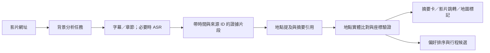

# AIYO 整體流程與技術替換評估

日期：2026-09-21。範圍：目前工作區程式、既有架構文件，以及官方 GitHub／文件。這是評估與實施順序，本次未替換正式服務、安裝依賴或修改產品程式。

本次未進行完整線上壓測；Docker 查詢沒有運行中容器。以下延遲風險來自呼叫路徑、設定與小型重現，不是已量測的正式環境 P95。上一輪的 616 項單元測試與建置通過，不代表影片內容正確率或真實模型延遲已驗收。

## 建議決策

保留 Next.js、React、Prisma、PostgreSQL／pgvector、MapLibre。優先重整資料證據、背景任務、偏好排序與工具執行，而不是全面改寫網站。

1. 立即修正影片時間來源、字幕單位與摘要內容。
2. 導入 BullMQ worker，讓影片分析與記憶整理離開同步 HTTP 回覆路徑。
3. 導入 AI SDK 作為模型、串流與工具呼叫的共同介面，沿用既有驗證器與行程變更保護。
4. 將偏好變成可測試的候選篩選與排序條件。
5. 地點搜尋、地理編碼、道路導航、公車鐵路時刻分開供應與驗證。
6. 在真實案例評估後，才決定是否引入 OR-Tools、更換模型或移除 Mem0。

## 已確認的問題

| 優先度 | 程式證據 | 現況與影響 | 建議 |
|---|---|---|---|
| P0 | `src/server/services/videoSummaryService.ts:414` | 說明欄 fallback 用 `index * 60` 與固定 45 秒建立時間，並非影片定位證據 | 未附章節時間的說明文字只產生無時間摘要；時間未知用 null |
| P0 | `src/server/providers/youtubeProvider.ts:1247` | 用數值大於 10000 決定字幕秒／毫秒；目前套件對不同 XML 格式輸出不同單位 | 在來源 adapter 依格式轉換，統一秒數；驗證影片長度與時間順序 |
| P0 | `src/server/services/videoSummaryService.ts:483` | simple 模式接受模型 startSeconds，固定加 30 秒作 endSeconds；只要來源是字幕就設為 high confidence | 模型引用 transcript line IDs，由程式回推時間範圍與 confidence |
| P0 | `src/lib/videoTimestamp.ts:45` | 有數字 startSeconds 就允許跳轉，先於低可信度檢查 | 區分可跳轉的字幕／ASR／章節時間與無法定位的推測資料 |
| P0 | `src/server/services/videoSummaryService.ts:464` | simple 摘要只列前 3 個地點與食物，片段摘要直接使用 evidence | 增加有引用的主題、亮點、注意事項與章節摘要；無證據不補故事 |
| P1 | `src/app/api/videos/summarize/route.ts` | 單次 POST 等待字幕、模型、地理驗證全部結束 | 提交 jobId 後回傳，背景分階段更新；重新整理後可恢復 |
| P1 | `src/server/video/simpleExtraction/index.ts`、`src/server/config.ts:79` | 預設單模型請求 180 秒；影片最多 8 chunks、concurrency 1，失敗 chunks 再逐一重試 | 區分互動與背景預算；總截止時間、部分結果、重試上限、模型容量控制 |
| P1 | `src/server/services/videoSummaryService.ts:523`、`src/server/video/syncExtractedLocationsWithSegments.ts` | 地點逐一 await geocode；未成功的 hints 可再進解析 | 每次分析共用解析結果，包含失敗快取；有限並行與 provider 限速 |
| P1 | `src/app/api/ai/chat/route.ts:85,100,193` | 記憶查詢後才建個人化 context；回覆前仍 await Mem0 寫入 | 可獨立資料讀取並行；記憶萃取用 durable queue／outbox，不用裸 fire-and-forget |
| P1 | `src/server/ai/ollamaClient.ts:147`、`openWebUiClient.ts:195` | 模型主路徑 `stream: false` | 一般回覆串流，工具進度與結構化结果分開；未驗證完成前不提交行程 |
| P1 | `src/server/chat/chatProgressStore.ts` | SSE 狀態存在程序內 Map | 持久化 job 狀態與有序事件，支援斷線重連與跨實例讀取 |
| P1 | `src/server/ai/planning/tripPlanResearchPolicy.ts`、`src/server/geo/osmPlacesSearchService.ts` | 已有偏好關鍵字，但複合「城市＋興趣＋餐廳」直接送 Photon；缺少共同的偏好評分結果 | 分離候選探索／店家實體解析，搜尋結果與行程使用同一排序器 |
| P1 | `src/server/maps/providers/photon.ts` | 現有 adapter 只保留國家等有限 metadata；rating／openingHours 雖有型別，不能代表真的有資料 | 加獨立 POI 詳細資訊來源；營業狀態有查核日期，不將缺值當成正常營業 |
| P2 | `src/app/chat/page.tsx`、`src/server/services/travelPlannerService.ts` | 本次約 3345／4646 行，路由、偏好、產生、修改與 UI 狀態耦合 | 沿功能邊界拆模組；檔案大本身不能證明執行慢 |

字幕單位的小型重現：已安裝套件的 ESM parser 對 `
` 輸出 offset=5000、duration=3000；現有轉換仍保留這兩個數字，因此 5 秒起始、3 秒長的片段會被解讀成 5000 秒起始、3000 秒長。原生 Node 套件入口另有匯入相容性問題；Next.js 打包路徑是否同樣受影響需另測。

## 影片、摘要與地圖的共同資料模型

- 保存 `videoId / transcriptVersion / lineId / startSeconds / endSeconds / source / evidence`。
- 地點提及與地點實體分開：同一餐廳可在影片第 2、8、15 分鐘出現，應保留所有提及，只共用一個 placeId。
- AI 產生摘要與候選名稱，不能自行創造座標、時間或營業狀態。
- 名稱、城市、國家、分店地址與空間範圍一起驗證；有座標不等於分店匹配正確。
- 地图資訊卡呈現：地點、影片來源、介紹片段、推薦原因、加入哪一天。點片段跳影片；選行程同步定位地圖。
- 描述 fallback 可呈現「依影片說明整理」，沒有時間依據時不提供假跳轉。
- 摘要快取包含 pipelineVersion、來源內容版本與語言；公共影片證據快取與使用者個人化排序分開。
- 若輸入只有字幕，目前無法完整理解純畫面中的招牌或沒有旁白的景點。畫面 OCR／視覺分析應是低召回案例的第二階段選項，保留影格時間並計算額外成本。

## 偏好如何真正影響規劃

目前已有 `aiContextBuilder`、個人化服務、Mem0 retrieval，也有基於 interests 的查詢。應改善的是決策連貫與可驗證性，不是再接一個記憶套件就算完成。

建議工具：`get_user_preferences`、`search_past_trips`、`get_current_trip`、`search_video_evidence`、`search_places`、`get_place_details`、`get_route_matrix`、`propose_itinerary_patch`。所有執行器使用伺服器 session userId，不接受模型指定其他使用者。

必要的本次旅程條件由系統直接準備；需要更深入比對過往旅程時再讓模型調工具。限制工具步數、總耗時、每次結果數量；已有資料不要反覆查。

偏好優先順序：本輪明確要求 > 本次行程設定 > 經確認長期偏好 > 從歷史行為推測。新旅程保留沿用偏好確認；同一旅程用 preference snapshot/version 記錄決定，避免每輪再問。

- 硬條件：禁忌食材、無障礙需求、不去的地點、指定必去、已知不可用日期。
- 軟偏好：咖啡、自然、美食、購物、寬鬆程度、少走路。
- 缺資料：餐廳過敏原、無障礙與開放資訊未知時標示待確認，不能自動判為符合。
- 過去建立的行程不等於已去過；必須區分草稿、已預訂、已完成，以及明確喜歡／不喜歡。
- 排序可結合偏好符合度、來源可靠度、交通負擔、價格與多樣性，但硬條件不能被高分抵銷。
- 每個候選保存「為何推薦／為何排除」與證據，搜尋頁和規劃器使用同一份結果。
- 最後用時間與交通約束檢查每日安排；LLM 解釋選擇，程式確保時間不衝突。

## GitHub 技術選型

| 技術 | 決策 | 對本專案的用途與成本 |
|---|---|---|
| [BullMQ](https://github.com/taskforcesh/bullmq) | 優先新增 | 沿用 Redis，獨立 worker 處理影片與記憶寫入；支援重試、去重與進度。需負責 worker 運維及冪等寫入；排隊不會讓單次推論本身變快 |
| [Vercel AI SDK](https://github.com/vercel/ai) | 漸進替換模型／工具呼叫封裝 | TypeScript 工具與前端串流較符合現有 Next.js；保留現有 schema validator、資料權限與行程 executor，先做一條 chat 路徑比較 |
| [yt-dlp](https://github.com/yt-dlp/yt-dlp) | 已有，整理為正式 adapter | 現在只是較後面的 fallback，且語言／字幕種類循序嘗試。應集中 metadata、字幕與章節取得並加總預算；仍可能受來源端限制 |
| [faster-whisper](https://github.com/SYSTRAN/faster-whisper) | 條件式新增 | 取得可處理音訊後，無可用字幕時產生有時間戳的 ASR；Python worker、模型儲存、CPU／GPU 成本必須量測。地名仍需校對 |
| [WhisperX](https://github.com/m-bain/whisperX) | 暫不預設加入 | 需要更細的字級對齊時再評估；額外模型、依賴與語言覆蓋需要驗證 |
| [pgvector](https://github.com/pgvector/pgvector) | 保留並善用 | Compose 已有 pgvector 映像；可結合全文與向量搜尋歷史行程、影片證據。中文斷詞與多語 embedding 用測試集選型 |
| [Mem0](https://github.com/mem0ai/mem0) | 先保留 | 已整合；移出同步回覆路徑並測量召回品質，確認仍無法達標才評估以 SQL＋pgvector 收斂，不立即整套重寫 |
| [Photon](https://github.com/komoot/photon) | 保留地理編碼職責 | 不承擔完整餐廳推薦與店家即時資訊。公共 demo 不保證可用性，正式流量考慮託管或地區資料部署 |
| [Valhalla](https://github.com/valhalla/valhalla) | 道路多交通模式候選 | 比較步行／自行車／汽車在目標城市的路線品質，再決定替換 OSRM；需路網資料與更新運維 |
| [OpenTripPlanner](https://github.com/opentripplanner/OpenTripPlanner) | 公共運輸候選 | 用 GTFS＋OSM 建立時刻與轉乘路線；覆蓋依賴各地資料，並非裝好即有全球完整班次。初期可評估託管交通資料供應商 |
| [OR-Tools](https://github.com/google/or-tools) | 第二階段試驗 | 用時間窗與交通矩陣驗證／安排每日順序；需停留時間、營業時間和可行矩陣；小行程先用有上限的簡單排程器 |
| [Langfuse](https://github.com/langfuse/langfuse) | 優先加觀測，可選部署方式 | 記錄模型、工具耗時、錯誤與評估；自架亦有運維成本，只記錄必要且適當處理的使用者資料 |

上述是依功能、現有架構與官方文件作出的工程建議，尚未完成本專案相容性 PoC。導入時鎖定版本，檢查對應版本授權、模型權重條件與 provider adapter 相容性；不根據 GitHub 星數直接替換。

官方補充依據：[BullMQ 重試](https://docs.bullmq.io/guide/retrying-failing-jobs)、[任務去重](https://docs.bullmq.io/guide/jobs/deduplication)、[OR-Tools 時間窗](https://developers.google.com/optimization/routing/vrptw)、[OSRM API](https://project-osrm.org/docs/v5.24.0/api/)。OSRM 的交通 profile 取決於路網預處理，不能只換 URL 裡的 profile 就假設同一服務具備所有交通模式。

## 實施順序與驗收

| 階段 | 工作 | 驗收 |
|---|---|---|
| A：正確性 | 統一字幕單位；取消假時間；摘要引用原始證據；地點分店驗證 | 無時間資料不出跳轉；超出片長被拒；人工標註影片的 POI 與時間準確率有報告 |
| B：等待與恢復 | BullMQ、持久化進度、並行讀取、geocode 去重與限流、記憶非同步 | 重整可恢復；相同影片同版本只執行一份任務；重試不重複寫入；慢 provider 不堵所有結果 |
| C：個人化 | 偏好快照、工具 executor、候選排序、來源引用 | 不同偏好的同城相同行程候選有合理差異；硬條件不違反；不將未完成行程誤判為去過 |
| D：排程與體驗 | 路線 provider 比較、時間窗、局部改行程、前端 profiling | 改一站只重算相鄰路段；地圖／摘要／行程同源；可追查每筆修改；實機無顯著互動阻塞 |

建議的初始目標，不是目前成績：提交工作與顯示狀態 P95 < 1 秒；快取摘要 P95 < 1 秒；地圖本地選點反應 < 200ms。普通 AI 回覆首個有效內容可先以 P95 < 3 秒為目標，但需依模型硬體與工具需求校正。影片分別量測有字幕、ASR、冷啟動、熱快取，不用單一平均值掩蓋等待。

先建立至少 30 支影片的標註集，涵蓋繁中、英、日、無字幕、同名店、多城市、長影片；衡量 POI precision/recall、時間錨點誤差、錯誤座標率與摘要無依據敘述率。另建立偏好衝突、跨輪補充、局部修改及不同行程狀態的對話案例。真正通過這些驗收後，才可聲稱整體順暢且可靠。
