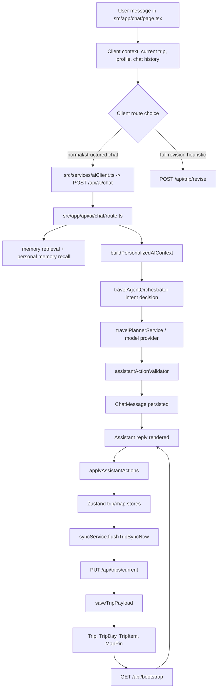

# Conversation And Itinerary Architecture Map

Date: 2026-06-15

## Scope

This map covers the AI conversation path that can read memory, decide intent, emit AssistantActions, mutate itinerary state, persist to the database, refresh from bootstrap, and isolate user data.

## Primary Flow

## Data Boundaries

- Session identity comes from NextAuth and server routes use the session user id, not a request-supplied user id.
- Trip access is enforced by `requireTripAccess` for existing trip ids.
- Personalized context is built per user id and must not include another user's trips, profile, memory, or chat messages.
- Client AssistantActions mutate local trip/map state first, then persist through `/api/trips/current`.

## Baseline Coverage Added

- Integration fixture seeds isolated User A and User B with deterministic profile, trips, chat memory, and active trip data.
- Integration tests cover personalized AI context, User B isolation, AssistantAction validation, trip persistence, DB reload, and forbidden cross-user writes.
- Playwright tests cover chat action payload, UI itinerary, map markers, bootstrap refresh persistence, destructive confirmation with no action, and User B empty state isolation.

