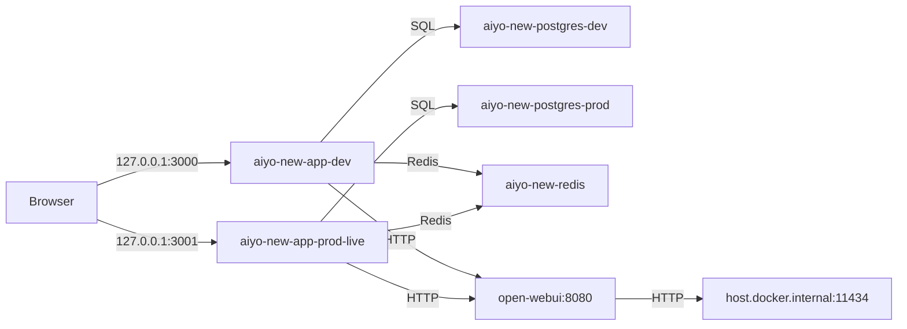

# AIYO_new Architecture

## Repository layout

- `AIYO_new/aiyo/` — active Next.js 16 app
- `AIYO_new/docs/` — architecture, migration, rollback, research
- `AIYO_new/docker-compose.yml` — six-service local stack
- `AIYO_new/scripts/` — backup, archive, verification, deploy helpers

## Runtime topology

## Application structure

Inside `aiyo/`:

- `src/app/` — App Router pages and API routes
- `src/components/` — chat, map, itinerary, home UI
- `src/stores/` — Zustand state
- `src/services/` — frontend API clients
- `src/server/` — planner, AI, geo, search, persistence
- `prisma/` — schema, migrations, seed

## AI flow

### Chat

- UI sends `POST /api/ai/chat`
- server entry: `src/app/api/ai/chat/route.ts`
- orchestration: `src/server/services/travelPlannerService.ts`
- primary reply generation now goes through Open WebUI chat completions
- Ollama-specific flows continue through the Open WebUI Ollama proxy

### Trip planning

- direct endpoint: `POST /api/ai/plan`
- revision endpoint: `POST /api/trip/revise`
- planner keeps fallback `travel_plan` behavior when AI output is unavailable or invalid

### Health / model checks

- `GET /api/ai/ollama-status` remains the frontend compatibility route
- when `OPENWEBUI_BASE_URL` is configured, the status route checks Open WebUI `/health` and `/api/models`

## Environment expectations

- Docker dev uses `aiyo/.env.dev`
- Docker prod-live uses `aiyo/.env.prod-live`
- `MEM0_ENABLED` now defaults to `false`
- `OPENWEBUI_BASE_URL` activates gateway mode
- `OPENWEBUI_API_KEY` is required for authenticated gateway calls once Open WebUI auth is enabled

## Legacy note

`mem0`, `searxng`, and `pgadmin` are no longer part of the active stack. Their assets are handled by the migration inventory, archive script, and rollback docs instead of the main Compose path.
