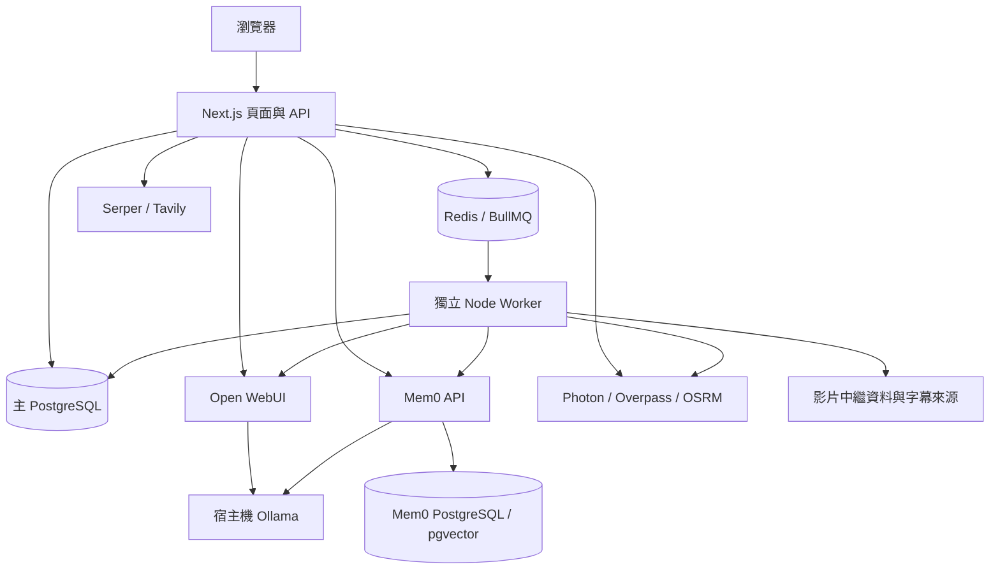
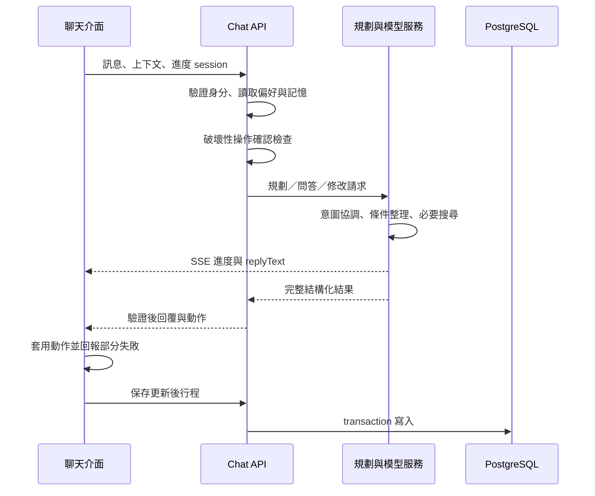
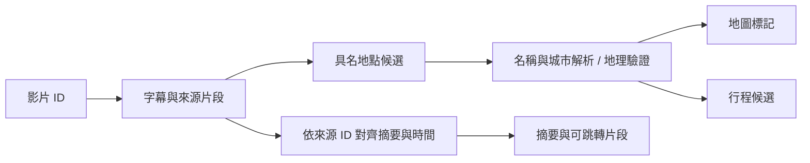

# 系統架構

本文件以 2026-10-04 檢視的程式為依據，功能基準為 `7cb2d2b`。部署方式見 [setup.md](setup.md)，資料表與路由見 [data-and-api.md](data-and-api.md)。

## 系統邊界與執行拓樸

AIYO 是以 Next.js 為主體的模組化 Web 應用，搭配獨立背景 worker 與模型、記憶服務。前後端共用 TypeScript 型別，但資料驗證與授權仍在伺服器進行。模型透過既定的規劃流程提出結果，不自行執行任意資料庫指令。

```mermaid
flowchart TB
    Browser[瀏覽器] --> App[Next.js 頁面與 API]
    App --> PG[(主 PostgreSQL)]
    App --> Redis[(Redis / BullMQ)]
    Redis --> Worker[獨立 Node Worker]
    Worker --> PG
    App --> Gateway[Open WebUI]
    Worker --> Gateway
    Gateway --> Ollama[宿主機 Ollama]
    App --> Mem0[Mem0 API]
    Worker --> Mem0
    Mem0 --> MemPG[(Mem0 PostgreSQL / pgvector)]
    Mem0 --> Ollama
    App --> Geo[Photon / Overpass / OSRM]
    Worker --> Geo
    Worker --> YouTube[影片中繼資料與字幕來源]
    App --> Search[Serper / Tavily]
```

Compose 定義 dev app、prod-live app、worker、主資料庫、Redis、Mem0、Mem0 資料庫及 Open WebUI 八個服務；Ollama 在宿主機執行。開發時也可只把相依服務放在 Docker，網站與 worker 在宿主機執行。

dev 與 prod-live 預設共用基礎設施。prod-live 是本機正式建置驗證入口，不等於與開發資料隔離的正式部署。worker 目前固定讀取 `.env.dev`；若需不同環境隔離，須另設 worker、資料庫及 `AIYO_JOB_PREFIX`。

主要業務資料在 PostgreSQL，瀏覽器 Zustand store 是互動狀態及已載入資料的表示。Redis 保存 BullMQ 工作；Mem0 使用另一個 PostgreSQL／pgvector。聊天 SSE 進度仍使用 Node 程序內 Map，並未具備跨實例共享能力。

## 模組責任

| 模組 | 責任 | 主要入口 |
| --- | --- | --- |
| 頁面與 UI | 對話、問答卡、行程編輯、影片摘要與地圖互動 | [app](../aiyo/src/app)、[components](../aiyo/src/components) |
| 前端同步 | API 呼叫、bootstrap、排隊儲存、忽略過期回應 | [syncService.ts](../aiyo/src/services/syncService.ts) |
| 對話協調 | 依訊息、上下文與偏好判斷問答、澄清、規劃及修改模式 | [travelAgentOrchestrator.ts](../aiyo/src/server/ai/travelAgentOrchestrator.ts) |
| 行程服務 | 組合搜尋與模型結果，驗證及建立 fallback | [travelPlannerService.ts](../aiyo/src/server/services/travelPlannerService.ts) |
| 動作驗證與套用 | 檢查結構化修改，執行並回報部分失敗 | [assistantActionValidator.ts](../aiyo/src/server/ai/assistantActionValidator.ts)、[applyAssistantActions.ts](../aiyo/src/lib/assistantActions/applyAssistantActions.ts) |
| 個人化 | 組合偏好、歷史互動與本輪要求，排序候選 | [aiContextBuilder.ts](../aiyo/src/server/ai/aiContextBuilder.ts)、[placePreferenceRanking.ts](../aiyo/src/server/personalization/placePreferenceRanking.ts) |
| 影片服務 | 字幕取得、摘要、地點解析、版本化快取 | [videoSummaryService.ts](../aiyo/src/server/services/videoSummaryService.ts) |
| 背景工作 | 建立及讀取工作、重試、擁有者檢查、消費佇列 | [jobs](../aiyo/src/server/jobs)、[video-worker.ts](../aiyo/scripts/video-worker.ts) |
| 地理資訊 | 地點、附近查詢、路線與供應者抽象 | [maps](../aiyo/src/server/maps)、[geo](../aiyo/src/server/geo) |
| 持久化 | 行程權限、序列化、交易式保存與載入 | [appStateService.ts](../aiyo/src/server/data/appStateService.ts) |

目前規劃服務與聊天頁面仍承擔較多責任。後續可依意圖解析、候選研究、規劃驗證與畫面狀態拆分，但檔案較大本身不能作為效能瓶頸的證據。

## 對話至行程的流程

```mermaid
sequenceDiagram
    participant UI as 聊天介面
    participant API as Chat API
    participant P as 規劃與模型服務
    participant DB as PostgreSQL
    UI->>API: 訊息、上下文、進度 session
    API->>API: 驗證身分、讀取偏好與記憶
    API->>API: 破壞性操作確認檢查
    API->>P: 規劃／問答／修改請求
    P->>P: 意圖協調、條件整理、必要搜尋
    P-->>UI: SSE 進度與 replyText
    P-->>API: 完整結構化結果
    API-->>UI: 驗證後回覆與動作
    UI->>UI: 套用動作並回報部分失敗
    UI->>API: 保存更新後行程
    API->>DB: transaction 寫入
```

聊天 POST 提供完整結果，SSE 透過獨立進度路由傳送文字與狀態。串流只顯示頂層 `replyText`，不把模型 reasoning 或尚未驗證的 JSON action 顯示成可執行內容。UI 收到文字不等於行程已完成保存。

規劃前若缺目的地或天數，回傳問答卡。已有足夠基本條件時，不要求使用者先填滿每項偏好。若有可沿用偏好，先確認再帶入規劃。本次明確條件優先於既有設定。

搜尋政策依需求決定：一般建議不必搜尋；營業時間、票價、天氣或最新事件等需查詢；未提供日期的完整行程以景點與餐廳候選為主。供應者失敗時保留其他可用結果，不將單一失敗放大成全部中斷。

模型輸出需通過結構與內容檢查。模型逾時、JSON 解析或來源失敗，而目的地與天數已知時，規劃器可退回較少項目的 `travel_plan`，具體地點僅取自已驗證研究結果或使用者明示地點，並附資料不足提示。這是降級結果，不代表與完整研究具有相同品質。

## 影片證據與背景處理

前端送出 `Prefer: respond-async` 至影片摘要 API 後取得 HTTP 202 與 `jobId`。worker 取得字幕及中繼資料，執行摘要與地點解析，更新階段進度，再保存結果。前端依工作 ID 輪詢並在重新整理後恢復。未帶此 header 的呼叫仍有同步相容路徑，因此不是所有 API 呼叫都以背景方式執行。

```mermaid
flowchart LR
    V[影片 ID] --> T[字幕與來源片段]
    T --> G[依來源 ID 對齊摘要與時間]
    T --> P[具名地點候選]
    P --> R[名稱與城市解析 / 地理驗證]
    G --> S[摘要與可跳轉片段]
    R --> M[地圖標記]
    R --> I[行程候選]
```

字幕 adapter 負責單位正規化；模型引用來源片段，時間由程式回推。沒有時間證據的描述摘要不生成可跳轉的假時間。地點提及與地點實體分開處理，同一地點可對應多個影片片段。

[videoPlaceResolver.ts](../aiyo/src/server/video/videoPlaceResolver.ts) 在單次分析中共用解析結果，限制同時查詢數為 2，失敗結果也可重用。摘要快取包含 pipeline 版本、影片、目的地及語言，避免只依影片 ID 沿用不適用結果。

影片工作最多嘗試 2 次，採指數退避；完成與失敗工作各以 24 小時／500 筆為保留上限。相同使用者及相同待處理輸入可去重，讀取結果時檢查擁有者。這不是跨所有使用者、所有時間的 exactly-once 保證。

## 個人化與記憶

個人化上下文結合 Profile、本次旅程、影片互動、已套用摘要及 Mem0 記憶。歷史建立過的旅程不能直接當作已去過的事實。明示「請記住」的陳述會以使用者訊息送入記憶整理，查詢或要求刪除記憶不應被誤存為新偏好。

目前候選排序是規則式排序：先依名稱與實際場所類別套用排除，再優先必去名稱及興趣匹配，分數相同時維持原始順序。它不是經訓練的推薦模型；價格、飲食禁忌、步行負擔等缺少場所資料時，不能宣稱已做完整硬限制求解。

Mem0 讀取仍位於回覆前的流程，有查詢逾時限制；寫入改走 `memory-write` 佇列，最多嘗試 3 次，由同一 worker 程序的另一個 consumer 處理。寫入成功後工作移除。若排入佇列失敗，聊天會保留，但目前沒有以資料庫 outbox 保證後續一定補寫。

## 一致性與安全操作

- **資料庫交易：** 行程 metadata、天數、活動及標記在同一 Prisma transaction 中更新，中途失敗回滾。
- **前端儲存序列：** 尚有 PUT 執行時保留後續修改；過期回應不得覆蓋新內容，切換行程或帳號後忽略舊回應。
- **背景補全：** 地點及照片解析完成前確認行程版本，避免還原已刪除或更名的活動。
- **名稱與座標：** 替換地點名稱時清除舊座標及標記連結；僅修改時間則保留原地點。
- **動作重播：** 執行器依請求／訊息及 action 資訊識別重複操作，並回報部分失敗；不是資料庫層的通用冪等帳本。
- **破壞性操作：** 整天清空等操作先建立有期限且綁定使用者／行程的待確認狀態；單一具名景點刪除不應升級成整天刪除。

## 地圖能力與擴充限制

MapLibre 負責呈現，Photon／Overpass 負責搜尋或地理資料，OSRM 負責可取得的道路路線。路線結果與估算、示意連線在 UI 中區分。欄位中存在 `openingHours`、`rating` 或 `verified`，不代表所有供應者都提供完整、即時且經人工驗證的內容。

目前沒有完整全球大眾運輸時刻、營業時間窗或最佳化求解器。OR-Tools、OpenTripPlanner、AI SDK、Langfuse 等出現在歷史選型報告中，未落實的項目不列為現有依賴。

多實例部署前需將聊天進度與其他程序內狀態改為共享機制，確認反向代理的 SSE 緩衝與逾時，並建立 worker 監控、環境隔離及備份恢復程序。增加 worker 並行數可能加重單 GPU 的競爭，不必然改善總延遲。
