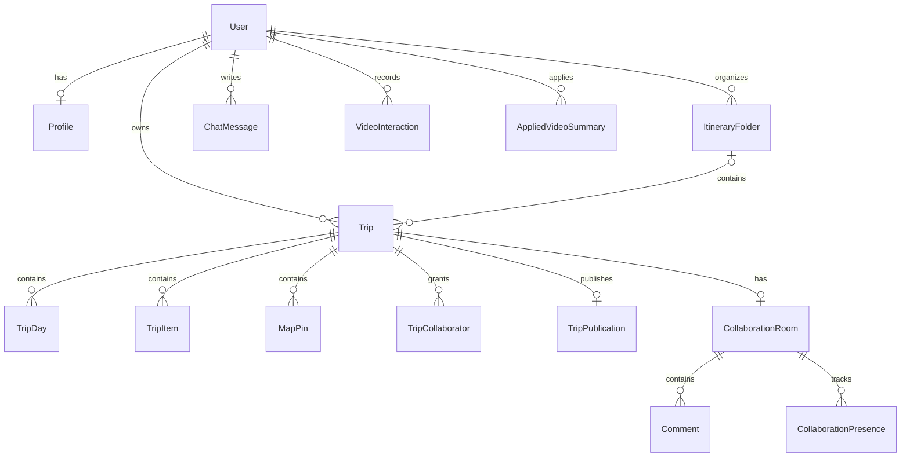

# 資料模型與 API 介面

核對日期：2026-10-04。資料結構以 [Prisma schema](../aiyo/prisma/schema.prisma)、前後端 payload 以 [共用型別](../aiyo/src/types/index.ts) 及實際 route 為準。本文件是介面導覽，不是完整 OpenAPI 規格。

## 核心實體



| 實體 | 資料責任與重要約束 |
| --- | --- |
| User／Profile | 登入帳號及 JSON 偏好。密碼保存 hash；OAuth 另有 Account 資料 |
| Trip／ItineraryFolder | 使用者所屬旅程與資料夾；索引支援依使用者及更新時間讀取 |
| TripDay | 每份行程的天數、主題及排序；`tripId + dayNumber` 唯一 |
| TripItem | 活動名稱、時間、類型、交通資訊與可選地點資料；使用 `day` 數字，不是 TripDay 外鍵 |
| MapPin | 座標、來源及顯示資訊；`linkedTripItemId` 為字串連結，非資料庫外鍵，需應用層維持一致 |
| ChatMessage | 使用者、可選 tripId、role、content 與結構化 metadata |
| TripCollaborator | 行程使用者權限；`tripId + userId` 唯一，role 是字串而非 schema enum |
| TripPublication | 篩選後公開快照、發布及撤銷時間；不等同整份私人 Trip 序列化 |
| VideoInteraction | 觀看／分析行為及擷取結果，供個人化上下文使用 |
| AppliedVideoSummary | 套用影片摘要的地點、片段與行程項目紀錄 |
| VideoSummaryCache | 共用摘要結果 JSON；欄位 `videoId` 實際存組合快取鍵，含版本、影片、目的地與語言 |
| CollaborationRoom／Comment／CollaborationPresence | 邀請碼、留言、在線狀態與選取位置 |
| Account／Session／VerificationToken | NextAuth adapter schema；目前登入策略為 JWT，不能因有 Session 表就推論使用 DB session |

Mem0 記憶不在主 Prisma schema 中，而由獨立服務與資料庫保存。BullMQ 的工作進度及結果在 Redis；瀏覽器待恢復工作記錄只是追蹤入口，不是工作的權威資料來源。

## 保存與公開快照

[appStateService.ts](../aiyo/src/server/data/appStateService.ts) 負責行程 payload 與資料表之間的轉換。更新行程時，把 metadata、舊資料移除、新天數、活動與標記建立，以及重新讀取放在同一 transaction。這避免寫入中途失敗留下半份行程，但不能單靠 transaction 解決兩個瀏覽器的編輯衝突。

[publicItineraryService.ts](../aiyo/src/server/services/publicItineraryService.ts) 以允許的欄位建立 publication snapshot。公開複製會建立新的私人行程；發布狀態與私人編輯狀態不是同一份任意 JSON。公開前仍應檢查標題與地點是否包含使用者自行輸入的私人內容。

## 路由導覽

下列列出主要路徑；完整方法、參數及錯誤處理應查看 [src/app/api](../aiyo/src/app/api)。舊相容路由與新路由可能並存，新增 client 前應確認主要呼叫點。

| 路徑 | 用途 |
| --- | --- |
| `/api/auth/register`、`/api/auth/[...nextauth]` | 註冊、登入與 session |
| `/api/bootstrap` | 登入後載入應用快照 |
| `/api/ai/chat` | 一般對話、結構化規劃與修改 |
| `/api/ai/plan`、`/api/trip/revise` | 直接規劃及修改入口 |
| `/api/chat/stream/register`、`/api/chat/stream/[sessionId]` | 進度註冊與 SSE 文字／狀態 |
| `/api/trips`、`/api/trips/current`、`/api/trips/active` | 行程清單、目前行程保存及切換 |
| `/api/trips/[id]`、`/api/trips/[id]/duplicate` | 個別旅程與複製 |
| `/api/trips/[id]/publish`、`/api/trips/public` | 發布管理與公開清單 |
| `/api/trips/public/[publicationId]/copy` | 公開快照複製 |
| `/api/trips/[id]/collaborators`、`/api/itinerary-folders` | 協作者與資料夾 |
| `/api/videos/recommendations`、`/api/videos/summarize` | 影片候選與分析提交 |
| `/api/videos/jobs/[jobId]` | 影片工作狀態與結果 |
| `/api/videos/summaries/apply` | 記錄摘要套用 |
| `/api/maps/search`、`/api/maps/nearby`、`/api/maps/route`、`/api/maps/matrix` | 地點與路線 |
| `/api/search/web` | 外部搜尋 |
| `/api/memories`、`/api/memories/[id]`、`/api/memories/retrieve` | 記憶管理及檢索 |
| `/api/users/me/preferences`、`/api/users/me/personalization-data` | 偏好與個人化資料 |
| `/api/collab/*`、`/api/realtime/*` | 協作、在線狀態及事件 |
| `/api/health`、`/api/ai/ollama-status` | 基礎健康與模型狀態；後者亦支援 gateway 模式 |

## 回覆格式與背景工作契約

一般 JSON 回覆透過 [api-response.ts](../aiyo/src/lib/api-response.ts) 建立：

```typescript
// 示意：具體 data 型別依 endpoint 決定。
{ success: true, data: result, meta?: metadata }
{ success: false, error: { code, message, details? } }
```

SSE 與 NextAuth 等路由使用各自協定，不能假設所有 endpoint 都回傳上述格式。

影片背景分析的 client 必須先登入，送出有效的 11 字元 YouTube ID 或可解析網址：

```http
POST /api/videos/summarize
Content-Type: application/json
Prefer: respond-async

{"videoId":"BAyQ10iPK4M","destination":"嘉義"}
```

成功提交回 202，`data` 含 jobId、ownerId、state 與 progress。client 再查詢 `/api/videos/jobs/{jobId}`；完成結果在 completed 狀態提供。Redis 無法接受工作時回 503，不回報假成功。未帶 `Prefer: respond-async` 時保留同步分析相容流程。

## 身分與權限邊界

受保護路由透過伺服器 session 取得 userId，不能信任 client 或模型傳入的擁有者。行程存取還須檢查所有權或對應權限。影片工作與聊天進度也檢查擁有者，避免猜測 ID 後讀取他人結果。

一般聊天 route 保留未登入時回覆的相容行為；這不代表匿名使用者能存取私人行程、記憶或已註冊進度 session。公開行程讀取另有刻意設計的公開入口。授權政策必須依路由判讀，不宜籠統宣稱全部 API 均需登入或全部可匿名使用。

跨使用者寫入、切換帳號後舊回應、部分動作失敗及公開快照欄位篩選均應納入回歸。既有驗證範圍見 [evaluation.md](evaluation.md)。
